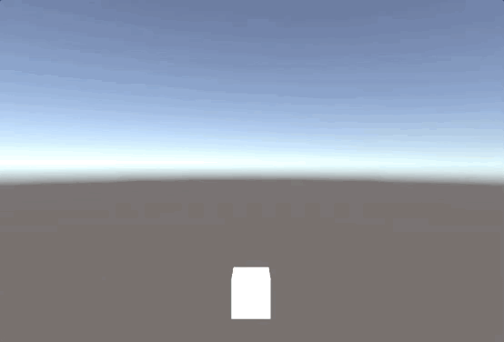
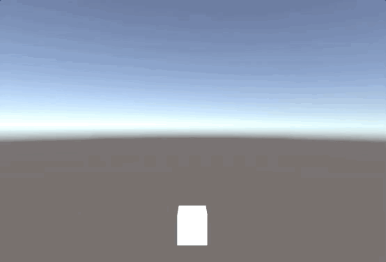
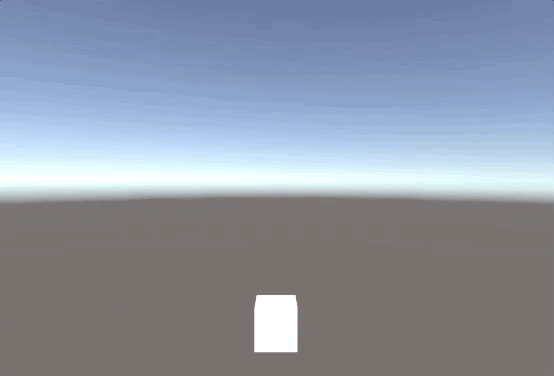

# Simple DOTween

This is a simple animation engine for Unity. I created this project to learn how [DOTween](http://dotween.demigiant.com/) works.

## Example 1

``` csharp
using UnityEngine;
using MyDOTween;

public class Test : MonoBehaviour {
    void Start() {
        DOTween.Init(Ease.Linear);
        transform.DOMove(new Vector3(0, 5, 0), 3).SetEase(Ease.InSine);
    }
}
```



## Example 2

``` csharp
using UnityEngine;
using MyDOTween;

public class Test : MonoBehaviour {
    void Start() {
        transform.DOMove(new Vector3(0, 5, 0), 3);
        transform.DOScale(new Vector3(3, 3, 3), 3);
        GetComponent<Renderer>().material.DOColor(Color.blue, 3);
    }
}
```



## Example 3

``` csharp
using UnityEngine;
using MyDOTween;

public class Test : MonoBehaviour {
    void Start() {
        Sequence mySequence = DOTween.Sequence();
        mySequence.Append(transform.DOMove(new Vector3(0, 5, 0), 1));
        mySequence.Append(transform.DOScale(new Vector3(2, 2, 2), 1));
        mySequence.Append(GetComponent<Renderer>().material.DOColor(Color.blue, 1));
    }
}
```


## Example 4

``` csharp
using UnityEngine;
using MyDOTween;

public class Test : MonoBehaviour {
    void Start() {
        Sequence mySequence = DOTween.Sequence();
        mySequence.Append(transform.DOMove(new Vector3(0, 5, 0), 1));
        mySequence.Append(transform.DOScale(new Vector3(2, 2, 2), 1));
        mySequence.Append(GetComponent<Renderer>().material.DOColor(Color.blue, 1));
        mySequence.Append(
            DOTween.Sequence()
                .Append(transform.DOMove(new Vector3(0, 1, 0), 1))
                .Append(GetComponent<Renderer>().material.DOColor(Color.white, 1))
                .Append(transform.DOScale(new Vector3(0.5f, 0.5f, 0.5f), 1))
        );
    }
}
```

